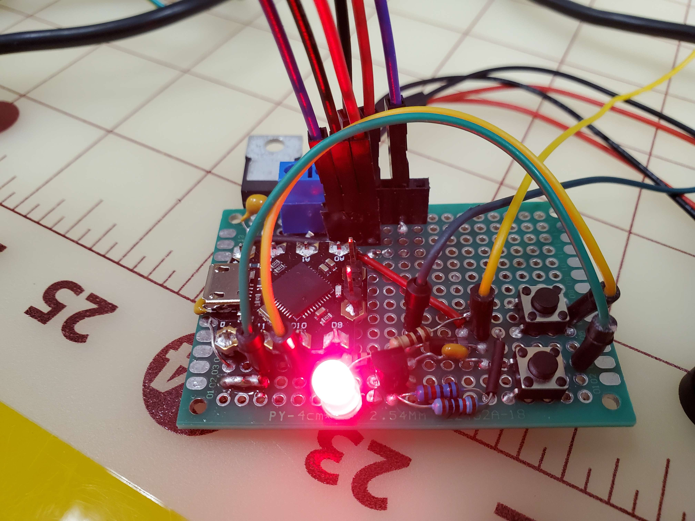

# NeurAidBeetlePrototype
This repository is for showcasing the Beetle Arduino microcontroller logic that was used to demonstrate a Minimal Viable Product for Team NeurAid in partnership with the Barrow Neurological Institute.

# Project Overview
The goal of this project repository is to showcase the Beetle Arduino microcontroller logic that was used to demonstrate a Minimal Viable Product for ASU team NeurAid in partnership with the Barrow Neurological Institute.  

  

  **Prototype Board**  
The scope of the prototype board was simply to demonstrate all functionality for the the project in a compact protoboard configuration. this would assist in getting a better grasp on the final boards size and placement for the housing. By developing this board the team also achieved a better understanding on how these two microphones function and can leverage that knowledge for the final prototype.  
  

# Code Breakdown

# How to Use

