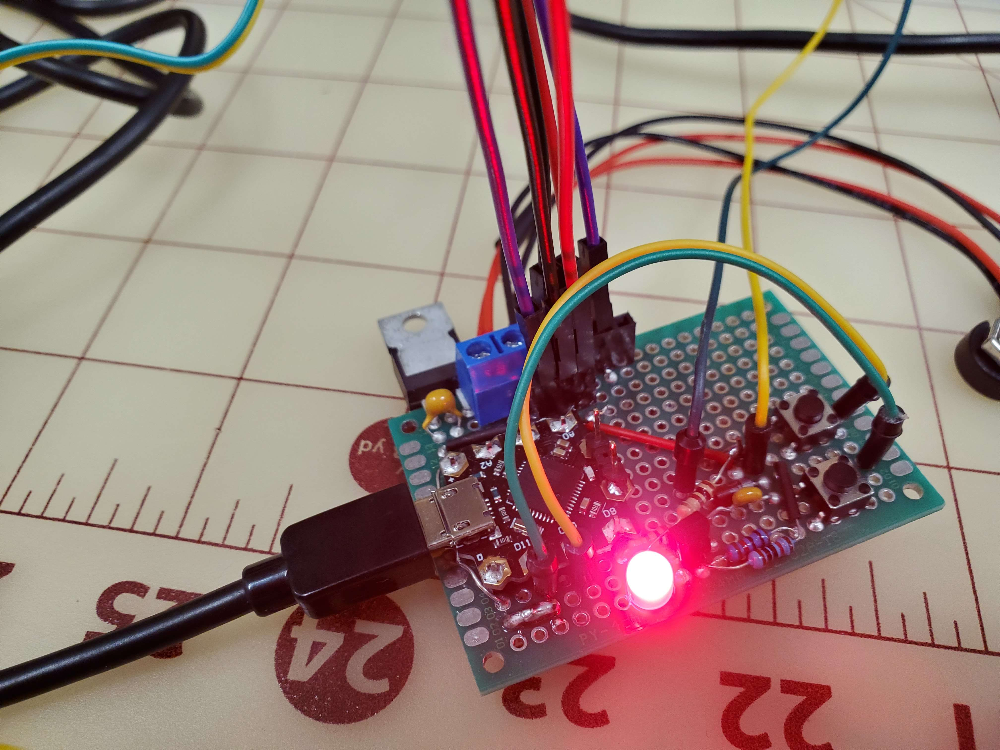

# Project Overview
The goal of this project repository is to showcase the Beetle Arduino microcontroller logic that was used to demonstrate a Minimal Viable Product for ASU team NeurAid in partnership with the Barrow Neurological Institute. MVP Board developed by Tyler Hulson, MVP Program developed by Tyler Hulson and Nithish Kumar. <br />

 <br />

## Project Requirements
<br /> **Functional Requirements** <br />
- As for technical functionality, the device must capture the user's voice intensity and
compute the error of that intensity to the ambient environment to gauge an appropriate
target level for the user to reach when communicating with others.
- The device will have a sleep mode where the vibratory motor does not initialize unless
it detects the user attempting to speak. Upon detection of the user's voice, it will
compute the error in real time and vibrate rapidly when the user's voice is low to
encourage a louder response and softly when the user's voice is loud to encourage a
quieter response.
- Users can adjust the system's haptic sensitivity. The system must capture ambient noise
and the user's vocal intensity. The system must compare ambient noise to user vocal
intensity to determine appropriate haptic feedback.

<br /> **Performance requirements** <br />

- Response time: The delay between sensing the audio and output feedback must be as
small as possible (in the order of microseconds). Huge delays cause confusion and false
interpretation for the user.
- Filtering: The background noise must be filtered properly to separate the audio signal
from the noise.
- Adaptability: The device must be capable of adapting to different surroundings and
adjusting its sensitivity according to those surroundings.
- Weight: The prototype must be light, as the user must be able to wear it for longer
periods. The size of the prototype can be reduced by optimizing the design parameters
without compromising the basic functionality of the system.
- Appearance and Visibility: The device must blend in with the body and stay hidden
under the user’s clothes.
- Communication: The data communication between components must be fast and
error-free.
- Protection: The device must be protected from dust and liquids as per the IP54
standard.

<br /> **Usability Requirements** <br />
- Discreteness Requirement: The device should be discrete, allowing the user to
maintain privacy and avoid unwanted attention.
- Justification: If the device is too noticeable (i.e., a hearing aid), the user might avoid
wearing it due to its appearance. Having a discrete product will allow the user to wear
it comfortably and not have to worry about unwanted attention while gaining the
benefits of the device.
- Accessibility Requirement: The device should be accessible for users with
disabilities, including those with motor and auditory impairments.
- Justification: Individuals diagnosed with Parkinson's disease commonly experience a
symptom that affects their fine motor control. As a result, the device must be designed
to be accessible and easy to use to accommodate these symptoms.

## Prototype Board
The scope of the prototype board was simply to demonstrate all functionality for the project in a compact protoboard configuration. This would assist in getting a better grasp on the final board size and placement for the housing. By developing this board, the team also gained a better understanding of how these two microphones function and can leverage that knowledge for the final prototype. <br />
<br />
Before jumping into board construction, every component was tested individually as a subsystem. Once that was completed, a rough schematic was drawn up and verified before proceeding with board fabrication. <br />
 <br />
 <br />
 <br />

## Component Breakdown
<br /> **Motor Subsystem** <br />
- 1x ZVP2106A MOSFET
- 1x 1N4007 Silicon Rectifier Diode
- 1x 100 Ohm Resistor
- 1x 104 Ceramic Capacitor

<br /> **Button Subsystem** <br />
- 2x 10k Ohm Resistors in Pull Down Configuration
- 2x mini push buttons
- 2x Jumper wires

<br /> **Power Supply Subsystem** <br />
- 1x LM7805 Linear Voltage Regulator (5v Output)
- 2x 9v DC Batteries
- 1x 106 Ceramic Capacitor
- 1x 104 Ceramic Capacitor
- 1x 2-pin Screw Terminal
- 2x 9v Battery Connectors

<br /> **Power LED Subsystem** <br />
- 1x 220 Ohm Resistor
- 1x Red Light Emitting Diode

<br /> **MAX4466 Microphone Subsystem** <br />
- 1x MAX4466 Microphone Module
- 1x 104 Ceramic Capacitor
- 1x 3-pin female header
- 3x Male female jumper wires

<br /> **MAX9814 Microphone Subsystem** <br />
- 1x MAX9814 Microphone Module
- 1x 5-pin female header
- 3x Male female jumper wires

<br />  <br />

# Code Breakdown
For the code breakdown I will be focusing on the final build for the MVP. The sketch name for the final build is 'sketch_apr21a.ino'.

## Detailed Sequence Diagram by Nithish Kumar
Below is the sequence diagram that describes the overall system logic for both team boards.
<br />  <br />

## Initalizing Variables

```c
//DEFINE DIGITIAL PINS
int pushBtn1 = 10; // defines the pin number for the first push button
int pushBtn2 = 11; // defines the pin number for the second push button
int motorPin = 9; // defines the digital out pin for the DC motor

// Define the pin connections for ANALOG in
const int micPin1 = A0; // connect the amplifier output to analog pin 0
const int micPin2 = A1; // connect the amplifier output to analog pin 2

// DEFINE MICROPHONE VARS
const int sampleWindow = 50; // Sample window width in mS (50 mS = 20Hz)
unsigned int sample; // the sample variable is initalized as an unsigned integer and will be used for collecting sample data from the microphone
unsigned int sample2; // sample2 will be used in the same way but for the second microphone connected
double previousUserNoiseFiltered = 0; // No noise to start
double previousMax4466Voltage = 0; // no voltage to start
double previousAmbientNoiseFiltered = 0; // no nouse to start
double previousMax9814Voltage = 0; // no voltage to start

/*
This project consisted of several counter variables as listed below.
These counter variables were utilized to guage the level of noise from each microphone as a voltage.
The team and I did not convert the microphone voltage to a straight decibel reading.
By using ranges and these counters we were able to isolate some noise.
*/

int userVoiceCount = 0; // no data
int highCount = 0;
int normalCount = 0;
int lowCount = 0;
int ambHighCount = 0;
int ambNormalCount = 0;
int ambLowCount = 0;
int i = 0; // iteration variable for motor while loop

// BUTTON VARS
/*
All button variables are initalized at high to start. This is part of the debounce logic.
*/
int btn1State = HIGH;         // current state of the button
int lastBtn1State = HIGH;     // previous state of the button
int btn2State = HIGH;         // current state of the button
int lastBtn2State = HIGH;     // previous state of the button
unsigned long lastDebounceTime = 0;  // last time the button was debounced
unsigned long debounceDelay = 10;    // debounce time in milliseconds

// MOTOR VARS
float intensityMultiplier = 1; // the intensity multiplier is used to provide the user the capability to increase and decrease motor intensity to a desired value.
int motordebugFlag = 0; // this is a debug flag utilized for testing motor intensity changes.
int motorFlag = 1; // this enables motor output for the system.
```

## Initalizing Functions

```c
/*
  motorFeedback fnc
  
  Function takes the ambient low, ambient normal, ambient high, low, normal, and high counts from the data processing section and determines which the error. 
  this function uses a simple P controller with a gain of 3 to determine if the user is in a low or high range of tolerance.
  Once the user has been determined to be high or low it will provide haptic feedback to the user from the DC motor in either a long pulse or short pulse respectively.
  No feedback if user is in normal range.
*/

// START OF FUNCTION
void motorFeedback(int lowCount,int normalCount,int highCount,int ambHighCount,int ambLowCount,int ambNormalCount) 
{
  // Check if counts for user and ambient are the same. This is important for computing the error.
  if(lowCount + normalCount + highCount == ambLowCount + ambNormalCount + ambHighCount)
  {
    // Take the difference and find the error between the two counts
    float highError = abs(ambHighCount - highCount);
    float lowError = abs(ambLowCount - lowCount);
    // compute the total error to compare against
    float totalError = abs(lowCount + normalCount + highCount - ambLowCount + ambNormalCount + ambHighCount);

    if (3*lowError > totalError) // 3 times the error for the low count must be greater than the total error for the user to speak softly
    {
      // lowCount is the highest
      if(motorFlag == 1) // this is the motorFlag variable from earlier checking it it is true / 1
      {    
        // provide short feedback
        
        /*
        While iteration variable i is less than 5,
        Define motor intensity as 110 times the intensity multiplier variable,

        By defining the motor as 110 times the intensity multiplier we guarantee a less intense haptic feedback for the user.
        
        activate the motor using a Pulse Wave Modulator with the corrected motor intensity,
        delay the system by 100ms to provide feedback,
        deactive the motor by setting the Pulse Wave Modulator to zero
        delay the system 100ms to provide feedback,
        iterate the i variable by 1 and repeat the loop until it is greater than 5.
        */

        while (i < 5)
        {
          // Would be ideal to change the motor pulse based on frequency, but Arduino is wack so I'm using a for loop and delay
          float motorIntensity = 110*intensityMultiplier;
          analogWrite(motorPin,motorIntensity);
          delay(100);
          analogWrite(motorPin,0);
          delay(100);
          i = i + 1;
        }
      }
      // Reset counts
      i = 0;
      lowCount = 0;
      normalCount = 0;
      highCount = 0;
    } 
    else if (3*highError > totalError) 
    {
      // highCount is the highest
      if(motorFlag == 1) // this is the motorFlag variable from earlier checking it it is true / 1
      {    
        // Provide long feedback
        
        /*
        While iteration variable i is less than 2,
        Define motor intensity as 90 times the intensity multiplier variable,

        By defining the motor as 90 times the intensity multiplier we guarantee a less intense haptic feedback for the user.

        activate the motor using a Pulse Wave Modulator with the corrected motor intensity,
        delay the system by 1 second to provide feedback,
        deactive the motor by setting the Pulse Wave Modulator to zero
        delay the system 1 second to provide feedback,
        iterate the i variable by 1 and repeat the loop until it is greater than 2.
        */
        
        while (i < 2)
        {
          // Would be ideal to change the motor pulse based on frequency, but Arduino is wack so I'm using a for loop and delay
          float motorIntensity = 90*intensityMultiplier;
          analogWrite(motorPin,motorIntensity);
          delay(1000);
          analogWrite(motorPin,0);
          delay(1000);
          i = i + 1;
        }
      }
      // Reset counts
      i = 0;
      lowCount = 0;
      normalCount = 0;
      highCount = 0;
    } 
    else 
    {
      // User is speaking normally
      // Reset counts
      lowCount = 0;
      normalCount = 0;
      highCount = 0;
      ambLowCount = 0;
      ambNormalCount = 0;
      ambHighCount = 0;
    }
  }
}
// END OF FUNCTION
```

## Program Void Setup

```c
void setup() {
   // Map hardware pins to microcontroller
   pinMode(pushBtn1, INPUT_PULLUP); // initialize the push button pin as a pullup
   pinMode(pushBtn2, INPUT_PULLUP); // initalize the push button pin as a pullup
   pinMode(motorPin, OUTPUT); // initialize the motor pin as an output
}
```

## Program Void Loop | Buttons

```c
  /*
  BUTTON DEBOUNCE SECTION
  Button 1 and Button 2 use two seperate debounce checks as implementing it in a function proved more trouble than it is worth.
  I hit a roadblock when working out a function for the push buttons so to keep it simple I have them as two seperate blocks in the main loop
  */
  
  // BUTTON 1
  int btn1Reading = digitalRead(pushBtn1); // read the state of the button
  if (btn1Reading != lastBtn1State) {    // if the button state has changed
    lastDebounceTime = millis();       // record the time of the state change
  }
  if ((millis() - lastDebounceTime) > debounceDelay) { // if the debounce delay has passed
    if (btn1Reading != btn1State) {     // if the button state is different from the current state
      btn1State = btn1Reading;          // update the current state
      if (btn1State == LOW) {       // if the button is pressed
        /*
        For the below if statement it is important to constrain the button increase so the user does not accidently burn out the motor
        */
        if(intensityMultiplier <= 2) // in the button intensityMultiplier is less than 2 then increase the intensity
        {
          intensityMultiplier = intensityMultiplier + 0.1; // iterate/increase intensity by 0.1
        }
      }
    }
  }
  lastBtn1State = btn1Reading;          // update the previous state

  // BUTTON 2
  int btn2Reading = digitalRead(pushBtn2); // read the state of the button
  if (btn2Reading != lastBtn2State) 
  {    // if the button state has changed
    lastDebounceTime = millis();       // record the time of the state change
  }
  if ((millis() - lastDebounceTime) > debounceDelay) { // if the debounce delay has passed
    if (btn2Reading != btn2State) {     // if the button state is different from the current state
      btn2State = btn2Reading;          // update the current state
      if (btn2State == LOW) {       // if the button is pressed
        /*
        For the below if statement it is important to constrain the button decrease so the user can still get some haptic feedback
        */
        if(intensityMultiplier >= 0.5) // if the intensity multiplier is greater or equal to 0.5 then
        {
          intensityMultiplier = intensityMultiplier - 0.1; // iterate/decrease the intesnity by 0.1
        }
      }
    }
  }
  lastBtn2State = btn2Reading;          // update the previous state
```

## Program Void Loop | Microphone Sampling

```c
  /*
  COLLECT MICROPHONE DATA OVER 50Hz SAMPLE WINDOW
  sample
  sample2
  Variables above are capturing the raw input from the microphones and directly converting them to voltage.
  */

  // MICROPHONE 1 -----------------------------------------------------------------------------------------------------------
  // Read the analog value from the MAX4466 amplifier output
  unsigned long startMillis = millis();  // Start of sample window
  unsigned int peakToPeak = 0;   // peak-to-peak level

  unsigned int signalMax = 0;
  unsigned int signalMin = 1024;

  // collect data for 50 mS
  while (millis() - startMillis < sampleWindow)
  {
    sample = analogRead(micPin1);
    if (sample < 1024)  // toss out spurious readings
    {
      if (sample > signalMax)
      {
        signalMax = sample;  // save just the max levels
      }
      else if (sample < signalMin)
      {
        signalMin = sample;  // save just the min levels
      }
    }
  }
  peakToPeak = signalMax - signalMin;  // max - min = peak-peak amplitude
  double max4466Voltage = (peakToPeak * 5.0) / 1024;  // convert to volts

  // MICROPHONE 2
  // Read the analog value from the MAX4466 amplifier output
  unsigned long startMillis2 = millis();  // Start of sample window
  unsigned int peakToPeak2 = 0;   // peak-to-peak level

  unsigned int signalMax2 = 0;
  unsigned int signalMin2 = 1024;

  // collect data for 50 mS
  while (millis() - startMillis2 < sampleWindow)
  {
    sample2 = analogRead(micPin2);
    if (sample2 < 1024)  // toss out spurious readings
    {
      if (sample2 > signalMax2)
      {
        signalMax2 = sample2;  // save just the max levels
      }
      else if (sample2 < signalMin2)
      {
        signalMin2 = sample2;  // save just the min levels
      }
    }
  }
  peakToPeak2 = signalMax2 - signalMin2;  // max - min = peak-peak amplitude
  double max9814Voltage = (peakToPeak2 * 5.0) / 1024;  // convert to volts
```

## Program Void Loop | Filtering

```c
 /*
  FILTERING SECTION
  Low pass filter as derived my Nithish Kumar for use with the MAX4466 (User Mic) and MAX9814 (Ambient Mic)
  
  Filter for microphone 1 (user mic). Low pass first order filter 200Hz. sampling frequency 7000Hz 
  Filter for microphone 2 (ambient mic). Low pass first order filter 500Hz sampling frequency 30000Hz

  Gains were generated using python math library.
  */

  float userNoiseFiltered = 0.83526683*previousUserNoiseFiltered + 0.08236658*max4466Voltage + 0.08236658*previousMax4466Voltage;
  previousUserNoiseFiltered = userNoiseFiltered;
  previousMax4466Voltage = max4466Voltage;

  float ambientNoiseFiltered = 0.90049055*previousAmbientNoiseFiltered + 0.04975473*max9814Voltage + 0.04975473*previousMax9814Voltage;
  previousAmbientNoiseFiltered = ambientNoiseFiltered;
  previousMax9814Voltage = max9814Voltage;
```

## Program Void Loop | Data Processing

```c
  /*
  DATA PROCESSING SECTION
  Process the data from the filtered microphone outputs and determine feedback using noise gates and counters.
  */
  
  //float errorThreshold = 1; // Threshold for error
  float userNoiseGate = 0.45; // user noise gate is a filtering method to reduce detecting background noise and only register spikes presumably from the user

  if(userNoiseGate <= userNoiseFiltered) // if the user noise gate is less than the filter then enter if
  {
    // PROCESS USER MIC
    userVoiceCount = userVoiceCount + 1; // iterate/increase user voice count by 1
    if(userVoiceCount >= 2) // filter out microphone spikes and check for a contoninous noise by adding a counter for the user noise
    {
      if(userNoiseFiltered > 1) // if the user is over 1 then the user is high
      {
        highCount = highCount + 1; // user is speaking at a high volume
      }
      else if (userNoiseFiltered >= 0.7 && userNoiseFiltered <= 1) // if the filtered noise is withing these bounds then the user is normal
      {
        normalCount = normalCount + 1; // iterate/increase the normal count by 1
      }
      else if (userNoiseFiltered >= 0.05 && userNoiseFiltered < 0.6) // if the filtered noise is within these bounds then the user is low
      {
        lowCount = lowCount + 1; // iterate/increase the normal count by 1
      }
    }
  }
  else if (userNoiseGate > userNoiseFiltered) // if the user noise gate is greater than the filtered user noise then process ambient data
  {
    // PROCESS AMBIENT MIC
    if(ambientNoiseFiltered > 1.3) // if ambient noise filter is greater than 1.3 then assume loud environment
      {
        ambHighCount = ambHighCount + 1; // iterate/increase high count by 1
      }
      else if (ambientNoiseFiltered >= 1.21 && ambientNoiseFiltered <= 1.3) // if ambient noise data is between 1.21 and 1.3 then assume normal environment
      {
        ambNormalCount = ambNormalCount + 1; // iterate/increase normal count by 1
      }
      else if (ambientNoiseFiltered >= 0.09 && ambientNoiseFiltered < 1.2) // if ambient noise is within 0.09 and 1.2 then assume low environment
      {
        ambLowCount = ambLowCount + 1; // iterate/increase low count by 1
      }
    }
```

## Program Void Loop | Motor Function and Count Resets

```c
// MINI DC HAPTIC MOTOR -----------------------------------------------------------------------------------------------------------
  motorFeedback(lowCount,normalCount,highCount,ambHighCount,ambNormalCount,ambLowCount); // Pass counts to motor function
  if (ambLowCount + ambNormalCount + ambHighCount >= 20) // if the ambient counts are greater than 20 then reset the count
  {
    // Reset counts
    ambLowCount = 0;
    ambNormalCount = 0;
    ambHighCount = 0;
  }
  if (lowCount + normalCount + highCount >= ambLowCount + ambNormalCount + ambHighCount) // if the user counts are greater or equal to the ambient counts reset the count
  {
    // Reset counts
    lowCount = 0;
    normalCount = 0;
    highCount = 0;
  }  
```

# How to Use
The board in it's current state is not designed to suite a wearable device, however can be utilized for demonstration. To use the board load the build program found in (build -> sketch_apr21a-001.zip -> sketch_apr21a -> sketch_apr21a.ino). <br />

The device will initialize and start collecting ambient microphone data. When speaking into the user microphone, it will collect a sample of counts up to the amount of ambient counts collected. The system will be delayed before providing the user with feedback. The Beetle Prototype is not perfect 100% of the time, but it does provide a confidence rating of 80% correct. <br />

Some assembly is required for the prototype board. The main components to connect are going to be the MAX4466 module, the MAX9814 module, the jumpers for the mini DC haptic motor, and connecting the 9 volt batteries. <br />

Note: This board is not protected under any warranty and must be constructed carefuly to avoid rapid disassembly. <br />

First, start by connecting the Vcc, Gnd, and Out pins in series with the MAX4466 module. The module will be facing away from the board and towards the regulator. Secondly, connect the vcc, gnd, and out pins in series for the MAX9814 module. Skip the gain pin, as that would limit the microphone's sensitivity. The module will be facing away from the board and away from the regulator, in the opposite direction to the MAX4466 module. Thirdly, connect the yellow wire from the DC haptic motor to the correlating yellow wire for the protoboard; do the same for the green wire. Lastly, connect your 9-volt batteries, and tada, you're good to go.<br />

# All Project Photos
 <br />
 <br />
 <br />
 <br />
 <br />
 <br />
 <br />
 <br />
 <br />
 <br />

# Project Videos


